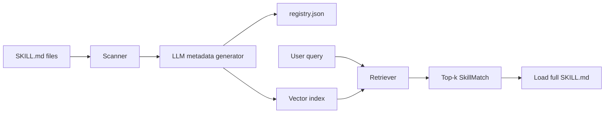

# skillregistry

Semantic skill registry for LLM agents. Scan Cursor-style `SKILL.md` files, auto-generate routing metadata at registration time, and retrieve relevant skills per query.

Inspired by the [langgraph-bigtool](https://github.com/langchain-ai/langgraph-bigtool) pattern: build a registry upfront, search at runtime, load full content only when matched.

## Install

```bash
cd skillregistry
pip install -e ".[all]"
```

| Extra | Includes |
|-------|----------|
| *(core)* | scanner, registry, mock embedder, CLI, eval |
| `[local]` | sentence-transformers + FAISS for production retrieval |
| `[openai]` | OpenAI LLM for metadata generation |
| `[dev]` | pytest, build, ruff |

## Quick start

```bash
# Register skills (mock LLM + mock embedder — no API, no GPU)
skillregistry register tests/fixtures/skills -o .skill-index --llm mock --embedder mock

# Search
skillregistry search "block shell commands with a hook" -i .skill-index

# List registered skills
skillregistry list -i .skill-index

# Show metadata + trigger questions
skillregistry show create-hook -i .skill-index

# Evaluate retrieval quality
skillregistry eval --paths tests/fixtures/skills -d eval/queries.jsonl --embedder mock --llm mock
```

### With real embeddings and OpenAI metadata

```bash
export OPENAI_API_KEY=sk-...

skillregistry register ~/.cursor/skills .cursor/skills \
  -o .skill-index \
  --llm openai:gpt-4o-mini \
  --embedder local
```

## Python API

```python
from skillregistry import SkillRegistry

# Build registry
registry = SkillRegistry.from_paths(
    ["tests/fixtures/skills"],
    llm="mock",
    embedder="mock",
)
registry.register()
registry.save(".skill-index")

# Load persisted registry
registry = SkillRegistry.from_directory(".skill-index")

# Retrieve skills for a query
matches = registry.retrieve("session start hook", top_k=3)
for m in matches:
    print(f"{m.score:.3f} {m.name}: {m.description[:60]}")

# Load full SKILL.md body on demand
doc = registry.load_skill(matches[0].id)
print(doc.body)
```

## How it works



### Registration (one-time per skill change)

1. Scan directories for `SKILL.md` files
2. Parse YAML frontmatter (`name`, `description`, optional `trigger_questions`)
3. If no user questions: LLM generates `trigger_questions`, `tags`, `one_line_summary`
4. Embed enriched metadata and build search index

### Retrieval (per query)

1. Embed user query
2. Search index for top-k matches
3. Return skill id, name, score, path
4. Load full `SKILL.md` body only when needed

## Skill metadata

Skills can include optional `trigger_questions` in frontmatter (user override):

```yaml
---
name: create-hook
description: Create Cursor hooks for agent events.
trigger_questions:
  - How do I run logic when an agent session starts?
tags:
  - hooks
  - cursor
---
```

If omitted, questions are auto-generated at registration.

## Evaluation

Measure routing quality with the built-in eval harness:

```bash
# Single run
skillregistry eval --paths tests/fixtures/skills -d eval/queries.jsonl -k 1 -k 3 -k 5

# Ablation: description-only vs full metadata
skillregistry eval --paths tests/fixtures/skills -d eval/queries.jsonl --ablate

# Save report
skillregistry eval --paths tests/fixtures/skills -d eval/queries.jsonl -r report.md
```

Metrics: **Recall@k**, **MRR**, **latency p50**. See [eval/README.md](eval/README.md).

## CLI reference

| Command | Description |
|---------|-------------|
| `register <paths...> -o DIR` | Scan, generate metadata, build index |
| `search <query> -i DIR` | Search registered skills |
| `list -i DIR` | List all skills |
| `show <id> -i DIR [--body]` | Show skill metadata |
| `eval -d DATASET` | Run retrieval benchmark |

### Register flags

- `--llm mock` | `openai:gpt-4o-mini` — metadata generator
- `--embedder mock` | `local` — vector embedder
- `--index-mode full` | `description` — what text to embed
- `--no-auto-metadata` — skip LLM generation
- `--changed-only` — incremental rebuild

## Publish to PyPI

```bash
pip install build twine
python -m build
twine upload dist/*
```

## Note on Cursor integration

This package does not replace Cursor's built-in skill description injection. For large skill libraries, pair with `disable-model-invocation: true` on skills and use this registry via hooks or MCP (planned v2) to route queries.

## License

MIT
