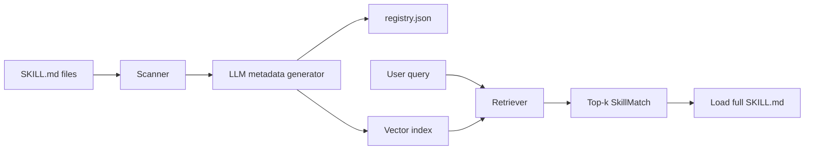

# skillregistry

Semantic skill registry for LLM agents. Scan Cursor-style `SKILL.md` files, auto-generate routing metadata at registration time, and retrieve relevant skills per query.

Inspired by the [langgraph-bigtool](https://github.com/langchain-ai/langgraph-bigtool) pattern: build a registry upfront, search at runtime, load full content only when matched.

## Install

From [TestPyPI](https://test.pypi.org/project/skillregistry/) (current release):

```bash
pip install -i https://test.pypi.org/simple/ skillregistry
```

Production setup (OpenAI metadata + local embeddings):

```bash
pip install -i https://test.pypi.org/simple/ "skillregistry[local,openai]"
```

For development from source:

```bash
git clone https://github.com/Aakash2512git/skillregistry.git
cd skillregistry
pip install -e ".[all]"
```

| Extra | Includes |
|-------|----------|
| *(core)* | scanner, registry, mock embedder, CLI, eval |
| `[local]` | sentence-transformers + FAISS for production retrieval |
| `[openai]` | OpenAI LLM for metadata generation |
| `[dev]` | pytest, build, ruff |

## Quick start

```bash
# Register skills (mock LLM + mock embedder — no API, no GPU)
skillregistry register tests/fixtures/skills -o .skill-index --llm mock --embedder mock

# Search
skillregistry search "block shell commands with a hook" -i .skill-index

# List registered skills
skillregistry list -i .skill-index

# Show metadata + trigger questions
skillregistry show create-hook -i .skill-index

# Evaluate retrieval quality
skillregistry eval --paths tests/fixtures/skills -d eval/queries.jsonl --embedder mock --llm mock
```

### With real embeddings and OpenAI metadata

```bash
export OPENAI_API_KEY=sk-...

skillregistry register ~/.cursor/skills .cursor/skills \
  -o .skill-index \
  --llm openai:gpt-4o-mini \
  --embedder local
```

## Python API

```python
from skillregistry import SkillRegistry

# Build registry
registry = SkillRegistry.from_paths(
    ["tests/fixtures/skills"],
    llm="mock",
    embedder="mock",
)
registry.register()
registry.save(".skill-index")

# Load persisted registry
registry = SkillRegistry.from_directory(".skill-index")

# Retrieve skills for a query
matches = registry.retrieve("session start hook", top_k=3)
for m in matches:
    print(f"{m.score:.3f} {m.name}: {m.description[:60]}")

# Load full SKILL.md body on demand
doc = registry.load_skill(matches[0].id)
print(doc.body)
```

## How it works



### Registration (one-time per skill change)

1. Scan directories for `SKILL.md` files
2. Parse YAML frontmatter (`name`, `description`, optional `trigger_questions`)
3. If no user questions: LLM generates `trigger_questions`, `tags`, `one_line_summary`
4. Embed enriched metadata and build search index

### Retrieval (per query)

1. Embed user query
2. Search index for top-k matches
3. Return skill id, name, score, path
4. Load full `SKILL.md` body only when needed

## Skill metadata

Skills can include optional `trigger_questions` in frontmatter (user override):

```yaml
---
name: create-hook
description: Create Cursor hooks for agent events.
trigger_questions:
  - How do I run logic when an agent session starts?
tags:
  - hooks
  - cursor
---
```

If omitted, questions are auto-generated at registration.

## Evaluation

Measure routing quality with the built-in eval harness:

```bash
# Single run
skillregistry eval --paths tests/fixtures/skills -d eval/queries.jsonl -k 1 -k 3 -k 5

# Ablation: description-only vs full metadata
skillregistry eval --paths tests/fixtures/skills -d eval/queries.jsonl --ablate

# Save report
skillregistry eval --paths tests/fixtures/skills -d eval/queries.jsonl -r report.md
```

Metrics: **Recall@k**, **MRR**, **latency p50**. See [eval/README.md](eval/README.md).

### Benchmark results

Evaluated on two datasets with the built-in harness (`Recall@1`, `MRR`, median latency):

| Dataset | Skills | LLM | Embedder | Index mode | Recall@1 | MRR | Latency p50 |
|---------|--------|-----|----------|------------|----------|-----|-------------|
| Fixtures | 5 | mock | mock | full | 96.2% | 0.962 | ~0 ms |
| Fixtures | 5 | OpenAI | local | full | **100%** | 1.000 | 7.3 ms |
| [mattpocock/skills](https://github.com/mattpocock/skills) | 38 | mock | local | full | 70.0% | 0.700 | 7.9 ms |
| [mattpocock/skills](https://github.com/mattpocock/skills) | 38 | OpenAI | local | description | 70.0% | 0.700 | 7.2 ms |
| [mattpocock/skills](https://github.com/mattpocock/skills) | 38 | OpenAI | local | **full** | **80.0%** | **0.800** | 7.1 ms |

**Key finding:** On the 38-skill mattpocock library, full metadata indexing (description + LLM-generated trigger questions + tags) outperforms description-only by **+10 points** Recall@1 — validating LLM-enriched routing metadata.

Reproduce the mattpocock benchmark:

```bash
export OPENAI_API_KEY=sk-...

skillregistry register external/mattpocock-skills/skills \
  -o .mattpocock-openai-local \
  --llm openai:gpt-4o-mini \
  --embedder local

skillregistry eval -i .mattpocock-openai-local \
  -d eval/mattpocock_queries.jsonl \
  -r reports/mattpocock_eval_openai_local.md

# Ablation: description-only vs full
skillregistry eval \
  --paths external/mattpocock-skills/skills \
  -d eval/mattpocock_queries.jsonl \
  --llm openai:gpt-4o-mini \
  --embedder local \
  --ablate \
  -r reports/mattpocock_ablation_openai_local.md
```

## CLI reference

| Command | Description |
|---------|-------------|
| `register <paths...> -o DIR` | Scan, generate metadata, build index |
| `search <query> -i DIR` | Search registered skills |
| `list -i DIR` | List all skills |
| `show <id> -i DIR [--body]` | Show skill metadata |
| `eval -d DATASET` | Run retrieval benchmark |

### Register flags

- `--llm mock` | `openai:gpt-4o-mini` — metadata generator
- `--embedder mock` | `local` — vector embedder
- `--index-mode full` | `description` — what text to embed
- `--no-auto-metadata` — skip LLM generation
- `--changed-only` — incremental rebuild

## Publish to PyPI

```bash
pip install build twine
python -m build

# TestPyPI (staging)
twine upload --repository testpypi dist/*

# Production PyPI
twine upload dist/*
```

## Note on Cursor integration

This package does not replace Cursor's built-in skill description injection. For large skill libraries, pair with `disable-model-invocation: true` on skills and use this registry via hooks or MCP (planned v2) to route queries.

## LangGraph deep agent integration

Use `skillregistry` as the **retrieval layer** (like [langgraph-bigtool](https://github.com/langchain-ai/langgraph-bigtool) for tools) and LangGraph as the **agent loop**. Skills are markdown instructions — retrieve and load them into context instead of executing Python functions.

### Architecture

```
User query → retrieve_skills(query) → load_skill(id) → LLM follows SKILL.md → (optional) retrieve again
```

1. **Startup** — load a pre-built index (one-time registration, no per-turn indexing cost)
2. **Per task** — agent calls `retrieve_skills` for top-k matches
3. **Load** — agent calls `load_skill` to get full `SKILL.md` body
4. **Deep agent** — multi-hop: retrieve → load → reason → retrieve again for sub-tasks

### LangGraph install

```bash
pip install skillregistry[local,openai]
pip install langgraph langchain-openai langchain-core
```

### Build the registry (once)

```bash
skillregistry register ~/.cursor/skills .cursor/skills \
  -o .skill-index \
  --llm openai:gpt-4o-mini \
  --embedder local
```

### LangGraph tools

```python
from langchain_core.tools import tool
from skillregistry import SkillRegistry

registry = SkillRegistry.from_directory(".skill-index")

@tool
def retrieve_skills(query: str, top_k: int = 3) -> str:
    """Search the skill library for skills relevant to the user's task."""
    matches = registry.retrieve(query, top_k=top_k)
    if not matches:
        return "No matching skills found."
    return "Matching skills:\n" + "\n".join(
        f"- id={m.id} name={m.name} score={m.score:.3f}: {m.description}"
        for m in matches
    )

@tool
def load_skill(skill_id: str) -> str:
    """Load full instructions for a skill by id or name. Call after retrieve_skills."""
    doc = registry.load_skill(skill_id)
    return f"# Skill: {doc.record.name}\n\n{doc.body}"
```

### ReAct agent

```python
from langgraph.prebuilt import create_react_agent
from langchain_openai import ChatOpenAI

llm = ChatOpenAI(model="gpt-4o-mini")
agent = create_react_agent(llm, [retrieve_skills, load_skill])

result = agent.invoke({
    "messages": [("user", "I want to block curl commands when the agent session starts")]
})
```

### Recommended system prompt

```text
You have access to a skill library via retrieve_skills and load_skill.

Workflow:
1. For every new user task, call retrieve_skills with a short search query.
2. Call load_skill for the best match before giving detailed guidance.
3. Follow the loaded skill instructions precisely.
4. If the task spans multiple domains, retrieve and load additional skills.

Do not guess skill content — always load_skill first.
```

### skillregistry vs skillweaver

| Use case | Package |
|----------|---------|
| Retrieve + load one skill per step | **skillregistry** |
| Complex multi-skill tasks with decomposition and DAG | **skillweaver-routing** |

For most LangGraph agents, start with **skillregistry**; add skillweaver when tasks routinely need multiple skills composed in order.

## License

MIT
